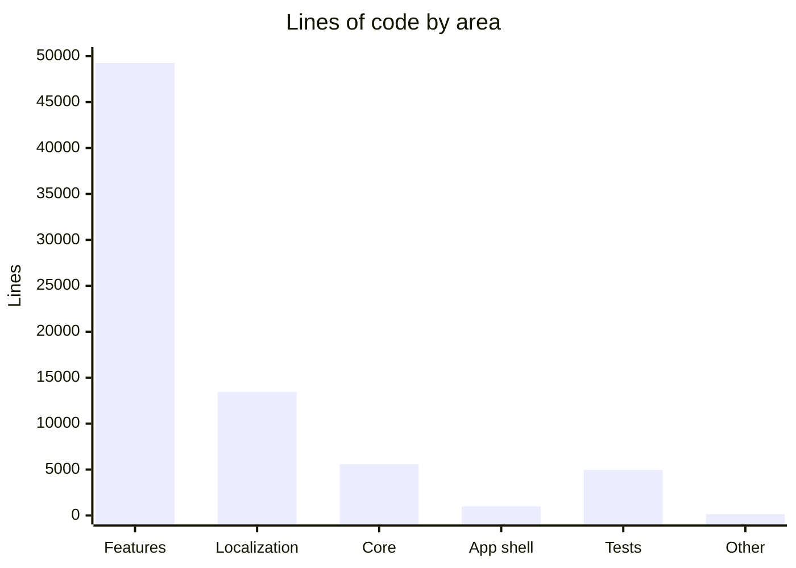

# By the Numbers

Codebase statistics for 360 FlatMates as of June 2026.

## Overview

| Metric | Value |
|--------|-------|
| **Total Dart lines** | 69,407 |
| **Total Dart files** | 259 |
| **Test files** | 36 |
| **Test lines** | 4,960 |
| **ARB localization files** | 2 (EN + HI) |
| **ARB lines** | 3,258 |
| **Generated files** (`.freezed.dart`, `.g.dart`) | 7 |
| **Total commits** | 53 |
| **First commit** | 2026-04-24 |
| **Latest commit** | 2026-06-18 |
| **App version** | 1.0.4+10 |
| **Flutter SDK** | >=3.35.0 |
| **Dart SDK** | ^3.9.0 |

## Lines of code by area

| Area | Files | Lines | % of total |
|------|-------|-------|------------|
| **Features** (`lib/features/`) | 196 | 49,257 | 71.0% |
| **Core** (`lib/core/`) | 55 | 5,581 | 8.0% |
| **Localization** (`lib/l10n/`) | -- | 13,440 | 19.4% |
| **App shell** (`lib/app/`) | -- | 985 | 1.4% |
| **Other** (main, bootstrap) | -- | 144 | 0.2% |

## Lines of code by feature

| Feature | Lines | Description |
|---------|-------|-------------|
| `discover` | 10,534 | Feed, map, search, filters, flat details |
| `shared` | 6,682 | 18+ reusable Flatmates* widgets |
| `chats` | 5,565 | Conversations, messages, realtime |
| `listings` | 5,075 | Create, edit, manage listings |
| `auth` | 4,200 | Phone/OTP/Google/Apple auth |
| `onboarding` | 3,782 | Multi-step state machine |
| `swipe` | 3,677 | Card deck, match celebration |
| `profile` | 2,236 | View, edit, help & safety |
| `settings` | 1,863 | Theme, palette, locale, privacy |
| `location` | 1,563 | Geolocation, city selection |
| `bootstrap` | 1,429 | Profile + catalogs loading |
| `visits` | 1,103 | Schedule, confirm, reschedule |
| `feedback` | 821 | Bug reports, feature requests |
| `notifications` | 339 | Notification list |
| `location_search` | 388 | Location search page |

## Language breakdown

## Localization coverage

| Language | File | Keys |
|----------|------|------|
| English | `lib/l10n/arb/app_en.arb` | 1,641 lines |
| Hindi | `lib/l10n/arb/app_hi.arb` | 1,617 lines |

## Package dependencies

| Category | Count |
|----------|-------|
| Runtime dependencies | 36 |
| Dev dependencies | 9 |

## Architecture metrics

| Metric | Value |
|--------|-------|
| Features | 15 |
| Core subsystems | 16 directories |
| Shared widgets | 18+ (Flatmates* family) |
| Riverpod providers | 7 root + feature-level |
| GoRouter routes | 40+ (including nested) |
| API endpoints | 30+ (from FlatmatesEndpoints) |
| Design token files | 9 (colors, typography, spacing, radius, shadows, gradients, motion, palette, theme) |
| Analytics events | 30+ |
