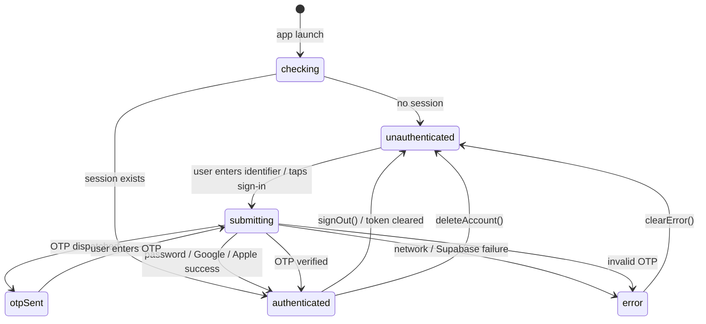

# Auth

Active contributors: Saksham Mittal, Ravi Sahu

Manages all authentication flows for the app: phone OTP, email OTP, password login, Google OAuth, Apple Sign In, password reset, and account deletion. The auth feature owns the session lifecycle and drives the router's redirect chain.

## Directory layout

```
lib/features/auth/
  auth_controller.dart          # Riverpod Notifier managing AuthState
  password_reset_controller.dart # Password reset OTP + set-password flow
  last_auth_method.dart         # Persists last-used auth method for pre-selection
  data/
    auth_repository.dart        # Supabase + backend auth operations
  domain/
    auth_state.dart             # AuthState freezed model + enums
    auth_state.freezed.dart     # Generated
  presentation/
    enter_phone_page.dart       # Phone/email identifier entry
    otp_page.dart               # OTP verification
    set_password_page.dart      # Mandatory post-OTP password setup
    add_phone_page.dart         # Post-Google phone linking
    forgot_password_page.dart   # Password reset entry
    password_reset_otp_page.dart # Reset OTP verification
    password_reset_success_page.dart
    ...                         # Additional presentation pages
```

## Key abstractions

| Abstraction | Role |
|-------------|------|
| `AuthController` | `Notifier<AuthState>` that orchestrates all auth flows, manages the state machine, and records last-used methods. |
| `AuthRepository` | Wraps Supabase auth SDK calls and backend validation (`GET /users/me`). Handles Google native/redirect fallback and Apple nonce flow. |
| `AuthState` | Freezed model holding `AuthStatus`, phone, identifier, channel, `needsPassword` flag, and `AuthStage` gate. |
| `PasswordResetController` | Separate `Notifier<PasswordResetState>` for the forgot-password OTP + set-password flow (both phone and email channels). |
| `LastAuthMethodStore` | Reads/writes the last-used auth method and a masked identifier hint to `SharedPreferences`. |
| `IdentifierStatus` | DTO returned by `POST /auth/identifier-status` indicating whether the identifier exists, is verified, has a password, and the recommended next step. |

## How it works

### AuthStatus state machine



### Identifier status check

When the user enters a phone number or email, `checkIdentifierStatus()` calls `POST /auth/identifier-status`. The response tells the UI whether to:

- Route to **password login** (existing account with password, `next_step == password`).
- Route to **OTP verification** (new account, or existing account without password, `next_step == otp`).

The controller stores `_resolvedHasPassword` so that after OTP verification it can force the mandatory `/set-password` step for passwordless accounts.

### Auth gate stages

The backend endpoint `GET /users/me/auth-state` returns a gate stage that the router uses to redirect users:

| Stage | Wire value | Meaning |
|-------|-----------|---------|
| `identifierVerification` | `identifier_verification` | Account needs identifier verification |
| `passwordSetup` | `password_setup` | Must set a password |
| `profileCompletion` | `profile_completion` | Missing profile fields |
| `appOnboarding` | `app_onboarding` | Onboarding not completed |
| `active` | `active` | Fully onboarded |

`AuthController.updateGateStage()` is called by `BootstrapController` after fetching bootstrap data. The router watches `authStage` to enforce the redirect chain.

### Supported auth methods

| Method | Enum value | Flow |
|--------|-----------|------|
| Phone + password | `phonePassword` | `signInWithPassword()` |
| Phone OTP | `phoneOtp` | `requestOtp()` then `verifyOtp()` |
| Email + password | `emailPassword` | `signInWithEmailPassword()` |
| Email OTP | `emailOtp` | `sendEmailOtp()` then `verifyEmailOtp()` |
| Google | `google` | Native ID-token when `GOOGLE_WEB_CLIENT_ID` is configured; OAuth redirect fallback otherwise |
| Apple | `apple` | Native `SignInWithApple` with SHA-256 nonce |

### Google sign-in resilience

`AuthRepository.signInWithGoogle()` attempts the native ID-token flow first. If native OAuth clients are not provisioned (missing SHA fingerprint), it silently falls back to the OAuth redirect flow. User cancellation is never swallowed; it rethrows so the UI can treat it as a benign dismiss.

### Password reset

`PasswordResetController` handles the forgot-password flow:

1. User enters identifier (phone or email).
2. `sendOtp()` dispatches a reset OTP via the appropriate channel.
3. `verifyOtpAndSetPassword()` verifies the OTP, sets the new password, and keeps the session alive so the user stays signed in.
4. `completePasswordReset()` records the last auth method and flips to authenticated.

### Account deletion

`AuthController.deleteAccount()` calls `DELETE /users/me` on the backend, which hard-deletes the Supabase auth user. Local sign-out and token clear are best-effort.

## Integration points

- **Router**: watches `authControllerProvider` for login/logout transitions and `authStage` for gate redirects.
- **Bootstrap**: `BootstrapController` calls `updateGateStage()` after fetching `/bootstrap` + `/auth-state`.
- **Supabase**: all auth SDK calls go through `AuthRepository`. No direct `Supabase.instance` usage in pages.
- **Token storage**: `AuthTokenStorage` persists the access token; `AuthController` listens for token-clear events to detect forced logouts.

## Key source files

| File | Purpose |
|------|---------|
| `lib/features/auth/auth_controller.dart` | Main auth state machine and flow orchestration |
| `lib/features/auth/data/auth_repository.dart` | Supabase + backend auth operations |
| `lib/features/auth/domain/auth_state.dart` | `AuthState`, `AuthStatus`, `AuthChannel`, `AuthStage`, `AuthMethod` enums |
| `lib/features/auth/password_reset_controller.dart` | Forgot-password OTP + set-password flow |
| `lib/features/auth/last_auth_method.dart` | Persists last-used auth method for pre-selection |
