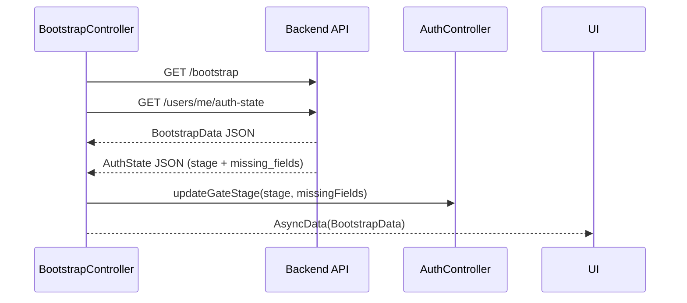

# Bootstrap

Active contributors: Saksham Mittal, Ravi Sahu

Loads the initial data the app needs after authentication: the user's flatmates profile, server-side catalogs, conversation/message counts, and the auth gate stage. Runs lazily (only when authenticated) and fetches two endpoints in parallel.

## Directory layout

```
lib/features/bootstrap/
  bootstrap_controller.dart     # AsyncNotifier fetching /bootstrap + /auth-state
  catalog_helpers.dart          # Utilities for extracting catalog data
  domain/
    bootstrap_models.dart       # BootstrapData, FlatmatesProfileModel, CatalogEntryModel
    bootstrap_models.freezed.dart # Generated
```

## Key abstractions

| Abstraction | Role |
|-------------|------|
| `BootstrapController` | `AsyncNotifier<BootstrapData?>` that parallel-fetches `/bootstrap` and `/auth-state`, updates the auth gate stage, and exposes `refresh()`. |
| `BootstrapData` | Freezed model containing `profile`, `catalogs`, `activeListingCount`, `conversationCount`, `unreadMessageCount`. |
| `FlatmatesProfileModel` | Full user profile: name, mode, city, lifestyle preferences, onboarding status, and more. |
| `CatalogEntryModel` | Keyed catalog entry with a version number and a JSON payload. Driven by the backend `/flatmates/catalogs` endpoint. |

## How it works

### Lazy fetch

`BootstrapController.build()` checks `authControllerProvider.isLoggedIn`. If the user is not authenticated, it returns `null` immediately. This prevents 401 requests at app launch before login completes. The post-login transition listener in `app.dart` calls `refresh()` with a warm token.

### Parallel fetch



The two requests run via `Future.wait`. The auth-state response is forwarded to `AuthController.updateGateStage()` so the router can enforce gate redirects.

### Refresh

`refresh()` retains the previous `AsyncValue` while reloading (`copyWithPrevious`) so widgets watching `valueOrNull` do not flicker to null mid-refresh. The `isLoading` flag stays available for spinners.

### BootstrapData shape

| Field | Type | Source |
|-------|------|--------|
| `profile` | `FlatmatesProfileModel` | `GET /bootstrap` -> `profile` key |
| `catalogs` | `List<CatalogEntryModel>` | `GET /bootstrap` -> `catalogs` key |
| `activeListingCount` | `int` | `GET /bootstrap` -> `active_listing_count` |
| `conversationCount` | `int` | `GET /bootstrap` -> `conversation_count` |
| `unreadMessageCount` | `int` | `GET /bootstrap` -> `unread_message_count` |

### FlatmatesProfileModel fields

Key fields include: `id`, `fullName`, `phone`, `email`, `profileImageUrl`, `mode` (room_poster / co_hunter / open_to_both), `profileStatus`, `onboardingCompleted`, `bio`, `age`, `profession`, `budgetMin`, `budgetMax`, `moveInTimeline`, `city`, `state`, `locality`, `sleepSchedule`, `cleanliness`, `foodHabits`, `smokingDrinking`, `guestsPolicy`, `workStyle`, `gender`, `genderPreference`, `preferences` (map).

## Integration points

- **Auth**: `BootstrapController` reads `authControllerProvider.isLoggedIn` to decide whether to fetch, and writes `updateGateStage()` on the auth controller.
- **Router**: watches `bootstrapControllerProvider` alongside the auth controller for redirect decisions.
- **Discover / Swipe / Chats**: all features read the bootstrap profile for the current user's mode, city, lifestyle preferences, and non-negotiables.
- **Onboarding**: `OnboardingController.submitNonNegotiables()` calls `bootstrapControllerProvider.notifier.refresh()` after updating the profile.

## Key source files

| File | Purpose |
|------|---------|
| `lib/features/bootstrap/bootstrap_controller.dart` | Parallel fetch + auth gate stage update |
| `lib/features/bootstrap/domain/bootstrap_models.dart` | `BootstrapData`, `FlatmatesProfileModel`, `CatalogEntryModel` |
| `lib/features/bootstrap/catalog_helpers.dart` | Utilities for catalog data extraction |
