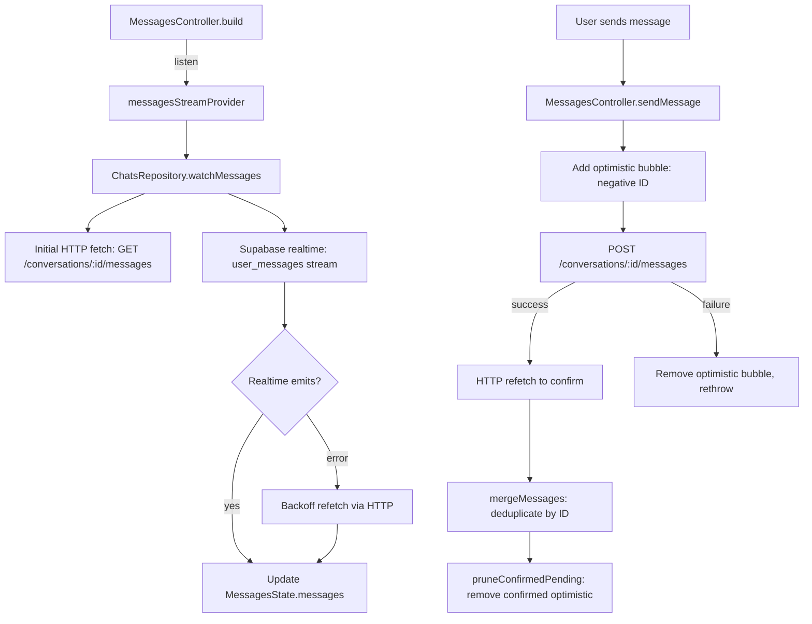

# Chats

Active contributors: Saksham Mittal, Ravi Sahu

The messaging and social feature. Provides a conversations list with Likes/Chats/Liked tabs, real-time chat threads powered by Supabase realtime with SSE fallback, optimistic message sends, incoming/outgoing likes management, match actions, block/report, and post-match Q&A nudges.

## Directory layout

```
lib/features/chats/
  conversations_page.dart       # Conversations list with segmented Likes/Chats/Liked tabs
  chat_thread_page.dart         # Individual chat thread with message bubbles
  chats_repository.dart         # API + Supabase realtime for messages, conversations, likes
  match_qna_nudge.dart          # Post-match Q&A bottom sheet
  application/
    messages_controller.dart    # FamilyNotifier managing message state per conversation
    chat_actions_controller.dart # Block, report, unmatch, match incoming like
  domain/
    chat_models.dart            # ChatMessage, ConversationSummaryModel, IncomingLikeModel, ChatPeer
    chat_models.freezed.dart    # Generated
    chat_report_reason.dart     # Report reason enum
  presentation/
    widgets/                    # ConversationCard, message bubbles, input bar, etc.
```

## Key abstractions

| Abstraction | Role |
|-------------|------|
| `ChatsRepository` | Fetches conversations, messages, incoming/outgoing likes. Sends messages. Manages Supabase realtime subscriptions. Handles block, report, unmatch, Q&A submission. |
| `MessagesController` | `FamilyNotifier<MessagesState, int>` (per conversation) that merges realtime stream updates with optimistic pending sends. |
| `MessagesState` | Holds `messages` (authoritative), `pendingMessages` (optimistic, negative IDs), loading/sending flags. `displayMessages` returns the merged list. |
| `ChatActionsController` | Stateless controller for block, report, unmatch, and match-incoming-like actions. Invalidates conversation/like providers after mutations. |
| `ConversationSummaryModel` | Freezed model for a conversation row: id, peer info, last message, unread count. |
| `ChatMessage` | Freezed model for a message: id, conversationId, senderId, body, messageType, attachmentUrl, createdAt, readAt. |
| `IncomingLikeModel` | Freezed model for an incoming/outgoing like: id, peer (`ChatPeer`), context property, timestamp. |
| `ChatPeer` | Compact peer profile: id, fullName, profileImageUrl, age, city, locality, profession, mode, matchPercentage. |

## How it works

### Conversations page

The page uses a `FlatmatesSegmentedControl` with three tabs:

- **Chats**: conversation list from `conversationsProvider` (FutureProvider).
- **Likes**: incoming likes from `incomingLikesProvider` with a "Match" button per card.
- **Liked**: outgoing likes from `outgoingLikesProvider`.

A Supabase realtime subscription on `user_conversations` (filtered by `user_one_id` or `user_two_id`) invalidates `conversationsProvider` on any row change.

### Real-time messaging



### Optimistic sends

`MessagesController.sendMessage()`:

1. Creates an optimistic `ChatMessage` with a negative ID (`_nextOptimisticId--`).
2. Appends it to `pendingMessages` so the UI renders the bubble immediately.
3. Calls `ChatsRepository.sendMessage()` (HTTP POST).
4. On success, does an authoritative HTTP refetch and merges via `mergeMessages()`.
5. On failure, removes the optimistic bubble and rethrows.
6. `pruneConfirmedPending()` matches pending messages against real messages by sender, body, attachment, message type, and a 2-minute time window.

### Message merging

`mergeMessages()` deduplicates by ID (refetched rows win for shared IDs) and sorts by `createdAt` ascending. This prevents a refetch that raced with a newer realtime emission from dropping messages.

### SSE fallback

When the Supabase realtime stream errors, `watchMessages()` applies exponential backoff (1s, 2s, 4s, ... up to 32s) and refetches via HTTP. This ensures messages arrive even when realtime is flapping.

### Matching incoming likes

From the Likes tab, tapping "Match" on an incoming like:

1. `ChatActionsController.matchIncomingLike()` calls `POST /swipes` with `action: like`.
2. Returns the new `conversationId`.
3. Navigates to the chat thread.
4. After a delay, shows `MatchQnANudgeSheet` for icebreaker Q&A.

### Block / report / unmatch

`ChatActionsController` provides `blockUser()`, `reportUser()`, and `unmatchConversation()`. All three invalidate `conversationsProvider`, `incomingLikesProvider`, and `outgoingLikesProvider` to refresh the UI.

### Q&A submission

`ChatsRepository.submitQnA()` sends normalized answers (keys `0`, `1`, `2`) to `POST /conversations/:id/qna`.

## Integration points

- **Auth**: chat threads require authentication; the shared Dio client handles token injection.
- **Bootstrap**: reads current user ID for message ownership and conversation filtering.
- **Discover**: like actions on listing cards invalidate `conversationsProvider`; contact action navigates to `/chats/:id`.
- **Swipe**: match celebrations create conversations and navigate to chat threads.
- **Supabase realtime**: `user_messages` table for per-conversation streams, `user_conversations` table for conversation-list invalidation.

## Key source files

| File | Purpose |
|------|---------|
| `lib/features/chats/conversations_page.dart` | Conversations list with Likes/Chats/Liked tabs |
| `lib/features/chats/chat_thread_page.dart` | Individual chat thread page |
| `lib/features/chats/chats_repository.dart` | API calls, Supabase realtime, message send/receive |
| `lib/features/chats/application/messages_controller.dart` | Per-conversation message state with optimistic sends |
| `lib/features/chats/application/chat_actions_controller.dart` | Block, report, unmatch, match incoming like |
| `lib/features/chats/domain/chat_models.dart` | `ChatMessage`, `ConversationSummaryModel`, `IncomingLikeModel`, `ChatPeer` |
| `lib/features/chats/match_qna_nudge.dart` | Post-match Q&A bottom sheet |
