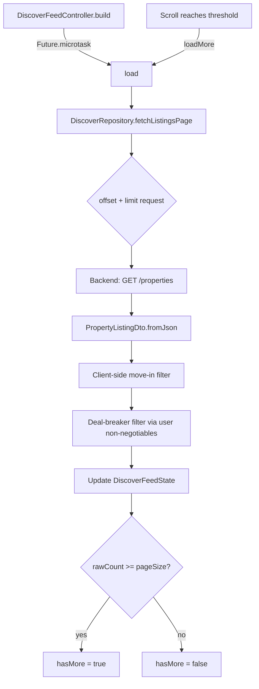

# Discover

Active contributors: Saksham Mittal, Ravi Sahu

The home feed feature. Displays a paginated list of property listings as horizontal cards, with filter chips, a search/filter bottom sheet, a map view, and a flat details page. Supports optimistic likes, location-based filtering, and deal-breaker filtering.

## Directory layout

```
lib/features/discover/
  discover_page.dart            # Home feed page with greeting, search, cards
  discover_repository.dart      # API calls for listings, likes, visits, society tags
  flat_details_page.dart        # Full listing detail with contact/schedule actions
  map_view_page.dart            # Map-based listing browser
  change_location_page.dart     # Location change page
  share_listing_card.dart       # Share listing bottom sheet
  application/
    discover_feed_controller.dart # Paginated feed state + filter orchestration
    map_listings_controller.dart  # Map-view listing state
    move_in_filter.dart           # Move-in timeline filter normalization
  data/
    property_listing_dto.dart     # Backend JSON -> PropertyListing mapping
  domain/
    property_listing.dart         # PropertyListing freezed model
  presentation/
    widgets/                      # Card, header, filter sheet, staggered appear, etc.
```

## Key abstractions

| Abstraction | Role |
|-------------|------|
| `DiscoverFeedController` | `Notifier<DiscoverFeedState>` managing paginated loading, filter updates, and optimistic like toggles. |
| `DiscoverRepository` | Fetches listings (`GET /properties`), toggles likes (`POST /swipes`), schedules visits, and votes on society tags. |
| `DiscoverFilters` | Immutable filter object: query, location, price range, sharing type, gender, features, bedrooms, pets, smoking, vibe, move-in timeline, geo coordinates + radius. |
| `PropertyListing` | Freezed domain model for a listing (id, title, price, images, features, preferences, owner, etc.). |
| `PropertyListingController` | `FamilyAsyncNotifier<PropertyListing, int>` for single-listing detail page with optimistic like toggling. |
| `filteredListingsProvider` | Derived `Provider` that applies client-side filtering (query, bedrooms, features, vibe, move-in) on top of the feed. |

## How it works

### Paginated feed



Pagination is driven by `rawCount` (items returned by the server before client-side filtering), not by the filtered item count. This prevents premature "end of feed" when client-side filters shrink a page.

### Filter system

Filters flow through `DiscoverFeedController`:

1. User interacts with filter chips or the filter sheet.
2. Controller updates `DiscoverFilters` via `updateFilters()`, `updateSearchQuery()`, `updateBedrooms()`, `updateFeature()`, `updateVibe()`, or `updateMoveInTimeline()`.
3. Controller calls `load()` to refetch with new server-side filters.
4. `filteredListingsProvider` applies additional client-side filtering (query text, bedrooms, features, vibe, move-in).
5. Location filters are persisted across filter changes via `_mergePersistentLocation()`.

### Stale-load protection

`DiscoverFeedController` uses a monotonic `_filterVersion` counter. Each filter change bumps the version. When a `load()` completes, it checks whether the version changed during the await; if so, the result is stale and discarded, and a trailing reload fires.

### Optimistic likes

`toggleLike()` in `DiscoverFeedController` flips the `liked` flag on the listing immediately (optimistic), then calls `DiscoverRepository.setLiked()`. On failure, the original list is restored (rollback). The flat details page has its own `PropertyListingController.toggleLike()` with the same pattern.

### Deal-breaker filtering

Both `DiscoverRepository` and `SwipeRepository` apply user non-negotiables as client-side filters. Supported deal-breakers: `food_veg_only`, `food_vegan_only`, `no_smoking`, `no_drinking`, `no_overnight_guests`, `no_pets`, `gender_female_only`, `gender_male_only`, `no_parties`, `min_tidy`.

### Flat details page

`FlatDetailsPage` uses `PropertyListingController` (a `FamilyAsyncNotifier` keyed by listing ID). It supports:

- Image carousel with full-screen gallery.
- Like/shortlist toggle (optimistic).
- Contact action (ensures liked, navigates to chat thread).
- Schedule visit (date picker + time slot picker).
- Owner profile bottom sheet.
- Society tag voting.
- Share listing bottom sheet.

## Integration points

- **Bootstrap**: reads the current user's profile for greeting, mode, city, and non-negotiables.
- **Location**: `LocationController` provides GPS-based location for geo-filtering.
- **Swipe**: shares `discoverFiltersProvider` so filter changes in Discover affect the Swipe deck and vice versa.
- **Chats**: like actions invalidate `conversationsProvider`; contact navigates to `/chats/:id`.
- **Router**: flat details at `/flat-details/:id`, browse listings at `/discover/browse-listings`.

## Key source files

| File | Purpose |
|------|---------|
| `lib/features/discover/discover_page.dart` | Home feed page |
| `lib/features/discover/discover_repository.dart` | Listing fetch, likes, visits, society tags |
| `lib/features/discover/flat_details_page.dart` | Listing detail page |
| `lib/features/discover/application/discover_feed_controller.dart` | Paginated feed + filter orchestration |
| `lib/features/discover/application/move_in_filter.dart` | Move-in timeline normalization |
| `lib/features/discover/data/property_listing_dto.dart` | Backend JSON DTO |
| `lib/features/discover/domain/property_listing.dart` | `PropertyListing` domain model |
| `lib/features/discover/map_view_page.dart` | Map-based listing browser |
