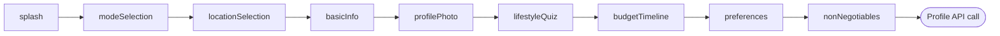

# Onboarding

Active contributors: Saksham Mittal, Ravi Sahu

Multi-step signup wizard that collects the user's mode, location, basic info, profile photos, lifestyle preferences, budget, and non-negotiables. Persists a draft to local storage so incomplete onboarding survives app restarts.

## Directory layout

```
lib/features/onboarding/
  onboarding_controller.dart    # Riverpod Notifier managing OnboardingState
  onboarding_page.dart          # Shell page that routes to the current step
  onboarding_splash_pages.dart  # Intro/splash screens
  mode_selection_page.dart      # Choose role: Room Poster / Co-Hunter / Open to Both
  location_selection_page.dart  # City + locality picker
  basic_info_page.dart          # Name, age, profession
  profile_photo_page.dart       # Photo upload
  lifestyle_quiz_page.dart      # Catalog-driven lifestyle questionnaire
  budget_timeline_page.dart     # Budget range + move-in timeline
  preferences_page.dart         # Gender, food, pets, smoking, guests, etc.
  non_negotiables_page.dart     # Deal-breaker selection + final submit
  waitlist_page.dart            # Waitlist confirmation (if applicable)
  domain/
    onboarding_state.dart       # OnboardingState freezed model + OnboardingStep enum
    onboarding_state.freezed.dart # Generated
```

## Key abstractions

| Abstraction | Role |
|-------------|------|
| `OnboardingController` | `Notifier<OnboardingState>` that manages step transitions, draft persistence, and the final profile submission. |
| `OnboardingState` | Freezed model holding the current `OnboardingStep`, all collected data (mode, location, photos, lifestyle answers, budget, preferences, non-negotiables), and submission state. |
| `OnboardingStep` | Enum of 9 steps: `splash`, `modeSelection`, `locationSelection`, `basicInfo`, `profilePhoto`, `lifestyleQuiz`, `budgetTimeline`, `preferences`, `nonNegotiables`. |
| `OnboardingDraftStorage` | Persistence layer (SharedPreferences) that saves and restores the in-progress onboarding draft. |

## How it works

### Step flow



Each step writes its data to `OnboardingState` and advances the `step` enum. Every data mutation also persists the full state to `OnboardingDraftStorage` via `_saveState()`.

### Draft persistence

On build, `_tryLoadSavedState()` reads the saved draft from storage. If the saved state has `isComplete == true`, it returns `null` (fresh start). Otherwise it restores the saved step and all collected fields. The draft is cleared (`_clearSavedState()`) only after a successful final submission.

### Back navigation

`OnboardingController.goBack()` uses a static `previousStep()` lookup to move one step back. The first interactive step (`modeSelection`) returns `null`, so system back navigation can exit onboarding entirely.

### Final submission

`submitNonNegotiables()` on the last step:

1. Builds a payload from all collected state (mode, name, age, city, locality, budget, move-in timeline, lifestyle answers, preferences, non-negotiables, photo URLs).
2. Normalizes preference values (e.g. `male_only` -> `male`, `yes`/`true` -> `yes`).
3. Calls `ProfileRepository.updateProfile()` with `onboarding_completed: true`.
4. Refreshes `bootstrapControllerProvider` so the updated profile propagates.
5. Sets `isComplete = true` and clears the draft.
6. On failure, sets `hasError = true` and preserves the draft for retry.

### Completion percentage

`OnboardingState.completionPercentage` computes a 0-100% value based on 10 fields: mode, fullName, age, city, photoUrls, lifestyleAnswers, budget, moveInTimeline, preferences, nonNegotiables.

## Integration points

- **Auth**: onboarding is gated by `AuthStage.appOnboarding` from the backend auth-state endpoint.
- **Bootstrap**: after successful submission, `bootstrapControllerProvider.notifier.refresh()` is called to sync the updated profile.
- **Profile**: `ProfileRepository.updateProfile()` sends the final payload to the backend.
- **Router**: redirects to `/onboarding` when `authStage == AuthStage.appOnboarding` or `profile.onboardingCompleted == false`.

## Key source files

| File | Purpose |
|------|---------|
| `lib/features/onboarding/onboarding_controller.dart` | Step transitions, draft persistence, final submission |
| `lib/features/onboarding/domain/onboarding_state.dart` | `OnboardingState` model and `OnboardingStep` enum |
| `lib/features/onboarding/onboarding_page.dart` | Shell page routing to the current step widget |
| `lib/features/onboarding/mode_selection_page.dart` | Room Poster / Co-Hunter / Open to Both selection |
| `lib/features/onboarding/location_selection_page.dart` | City + locality picker with search |
| `lib/features/onboarding/lifestyle_quiz_page.dart` | Catalog-driven lifestyle questionnaire |
| `lib/features/onboarding/non_negotiables_page.dart` | Deal-breaker selection and final submit |
