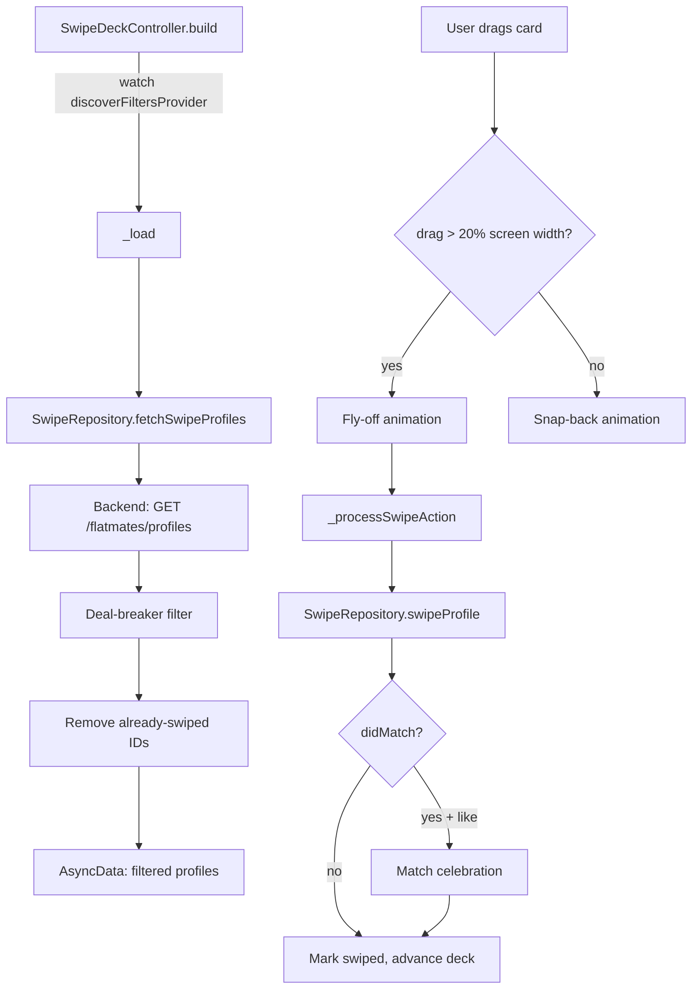

# Swipe

Active contributors: Saksham Mittal, Ravi Sahu

A Tinder-style card deck for browsing flatmate profiles. Users swipe right to like or left to pass, with drag gestures, button taps, compatibility rings, profile view tracking, match celebrations, and undo support.

## Directory layout

```
lib/features/swipe/
  swipe_deck_page.dart              # Main deck page with gesture handling + animations
  swipe_deck_actions.dart           # Part file for rotation/progress calculations
  swipe_repository.dart             # API calls for fetching profiles + recording swipes
  match_celebration_screen.dart     # Match animation screen
  match_qna_nudge.dart              # Post-match Q&A bottom sheet
  application/
    swipe_deck_controller.dart      # Deck state: load, markSwiped, undoSwipe, refresh
    profile_compatibility.dart      # Client-side compatibility scoring cache
    profile_view_tracker.dart       # Tracks time spent viewing each profile
  presentation/
    widgets/                        # SwipeCardStack, SwipeActionBar, SwipeDeckHeader, etc.
```

## Key abstractions

| Abstraction | Role |
|-------------|------|
| `SwipeDeckController` | `Notifier<AsyncValue<List<SwipeProfile>>>` managing the deck: load profiles, mark swiped, undo, refresh. |
| `SwipeRepository` | Fetches swipe profiles (`GET /flatmates/profiles`), records swipes (`POST /swipes`), and tracks profile views (`POST /profile-views`). |
| `SwipeProfile` | Profile model with lifestyle fields, listing details, and non-negotiables. Parsed from the backend API. |
| `SwipeResult` | Result of a swipe action: `didMatch` boolean and optional `conversationId`. |
| `ProfileCompatibilityCache` | Caches client-side compatibility scores between the current user and each profile. |
| `ProfileViewTracker` | Records start time for each profile view; `finish()` returns the duration for the analytics call. |

## How it works

### Card deck flow



### Gesture handling

The deck uses raw `Listener` + `onHorizontalDrag*` callbacks (not `GestureDetector`) to avoid gesture arena conflicts with child widgets:

1. **Drag start**: captures initial offset.
2. **Drag update**: accumulates horizontal offset.
3. **Drag end**: if `|offset| > 20% screen width`, triggers fly-off; otherwise snap-back.
4. **Fly-off**: 200ms ease-in animation to 1.5x screen width, then processes the swipe action.
5. **Snap-back**: 300ms ease-out animation back to zero.

Button taps (`_triggerButtonSwipe`) seed a 25% screen-width offset and reuse the same fly-off pipeline.

### Swipe actions

Right = `like`, left = `pass`. After the fly-off animation completes:

1. Records profile view duration via `ProfileViewTracker`.
2. Calls `SwipeRepository.swipeProfile()` with `target_type: user`.
3. On success, marks the profile as swiped (removes from deck).
4. If `didMatch == true` and action was `like`, shows the match celebration.
5. Invalidates `conversationsProvider` and `outgoingLikesProvider` on like.

### Compatibility scoring

`ProfileCompatibilityCache.resultFor()` computes a compatibility percentage between the current user and a peer using the client-side algorithm in `core/compatibility/`. Results are cached per peer ID to avoid recomputation during animations.

### Match celebration

When a mutual match occurs, `MatchCelebrationRoute` opens a dedicated screen with animation. After dismissal, `MatchQnANudgeSheet` prompts both users to answer icebreaker questions.

### Undo

`_undoLastSwipe()` restores the most recently swiped profile to the front of the deck. The `SwipeDeckController.undoSwipe()` method removes the ID from the swiped set and prepends the profile to the current list.

### Deal-breaker filtering

Same as Discover: client-side filtering by the user's non-negotiables (food, smoking, drinking, guests, pets, gender, parties, cleanliness). Also applies move-in timeline filtering.

### Profile view tracking

`ProfileViewTracker.start(profileId)` records the current time. When the user swipes to the next card, `finish()` computes the duration and the page calls `SwipeRepository.recordProfileView()` with `duration_seconds`, `scroll_depth_percent`, and `source: swipe_deck`.

## Integration points

- **Discover**: shares `discoverFiltersProvider` so location/move-in filter changes propagate between Discover and Swipe.
- **Chats**: swipe matches invalidate `conversationsProvider` and navigate to the chat thread.
- **Bootstrap**: reads the current user's profile for non-negotiables and compatibility scoring.
- **Router**: match celebration pushes a route; Q&A nudge shows a bottom sheet.

## Key source files

| File | Purpose |
|------|---------|
| `lib/features/swipe/swipe_deck_page.dart` | Main deck page with gesture handling and animations |
| `lib/features/swipe/swipe_repository.dart` | Profile fetch, swipe API, profile view tracking |
| `lib/features/swipe/application/swipe_deck_controller.dart` | Deck state management |
| `lib/features/swipe/application/profile_compatibility.dart` | Client-side compatibility cache |
| `lib/features/swipe/application/profile_view_tracker.dart` | View duration tracking |
| `lib/features/swipe/match_celebration_screen.dart` | Match animation screen |
| `lib/features/swipe/match_qna_nudge.dart` | Post-match Q&A sheet |
