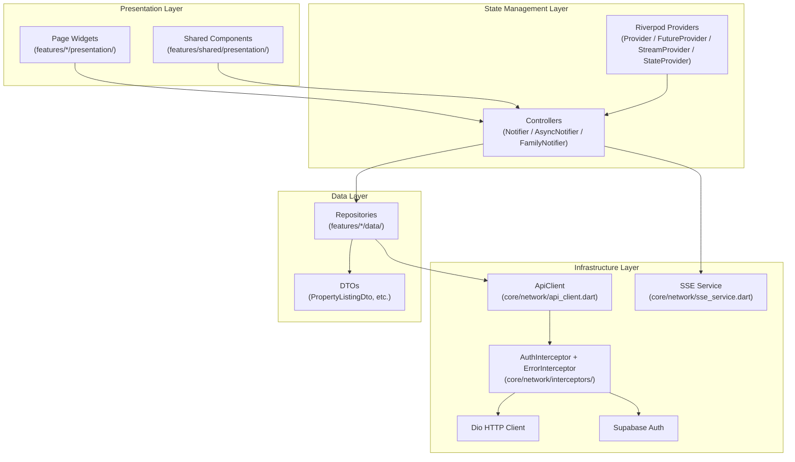
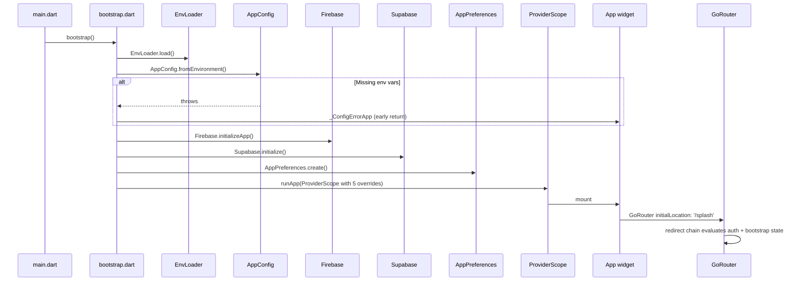
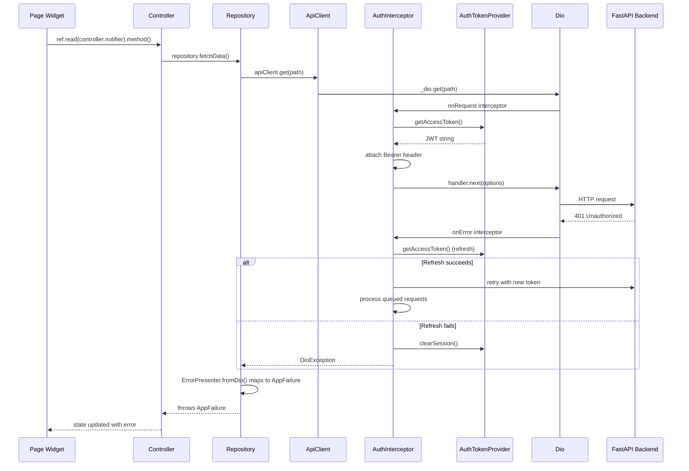

# Architecture

360 FlatMates is a Flutter mobile client organized in a feature-first layout with four distinct layers. Riverpod manages state, GoRouter handles navigation, and a shared Dio client routes all authenticated HTTP traffic through a centralized interceptor chain.

## Layer Diagram



### Layer Responsibilities

| Layer | Location | Responsibility |
|-------|----------|----------------|
| **Presentation** | `lib/features/*/presentation/` | Pages, widgets, UI state via `StateProvider` |
| **State Management** | `lib/features/*/application/` | Controllers with named methods, business logic |
| **Data** | `lib/features/*/data/` | Repositories, DTOs, API calls through `ApiClient` |
| **Infrastructure** | `lib/core/` | HTTP client, interceptors, storage, theme, errors, analytics |

The `lib/core/` directory is strictly for technical plumbing. Feature logic lives under `lib/features/`.

## Startup Flow



### Provider Overrides at Root

`ProviderScope` receives five overrides injected in `lib/bootstrap.dart`:

1. `appConfigProvider` -- environment configuration (API base URL, Supabase keys)
2. `appPreferencesProvider` -- persisted SharedPreferences wrapper
3. `secureStoreProvider` -- secure key-value storage
4. `notificationServiceProvider` -- Firebase Messaging with optional disable
5. `analyticsServiceProvider` -- Crashlytics + Analytics facade

## Authenticated HTTP Request Flow

Every authenticated API call follows the same path from feature code to backend.



### Interceptor Chain

The `ApiClient` (`lib/core/network/api_client.dart`) wraps a `Dio` instance with:

1. **AuthInterceptor** (`lib/core/network/interceptors/auth_interceptor.dart`) -- attaches Bearer token, handles 401 with single-flight token refresh and request queuing to prevent race conditions.
2. **LogInterceptor** (debug mode only) -- logs requests/responses via `debugPrint`.
3. **ErrorPresenter** (`lib/core/errors/error_presenter.dart`) -- converts `DioException` into typed `AppFailure` subclasses (`NetworkFailure`, `AuthExpiredFailure`, `ValidationFailure`, etc.).

### Token Refresh Race Condition Prevention

When multiple requests hit 401 simultaneously, `AuthInterceptor` uses a `Completer` pattern: the first request triggers a refresh, subsequent requests queue behind it. Once the refresh completes, queued requests replay with the new token. This prevents token-refresh storms.

## Architecture Boundary Exceptions

The architecture enforces a strict `core` -> `features` boundary: `lib/core/` must not import from `lib/features/`. There are two intentional exceptions:

1. **`lib/core/app_config/force_update_page.dart`** -- renders a full-screen force-update page. This lives in `core/` because it must be available before any feature code mounts (it replaces the entire app tree when a mandatory update is detected).

2. **`lib/core/widgets/location_selector.dart`** -- a reusable location picker widget used by both onboarding and settings features. Placed in `core/widgets/` to avoid a circular dependency between those two features.

Both exceptions are presentation-only and contain no business logic.

## Feature Structure

Each feature under `lib/features/` follows a consistent internal layout:

```
features/<name>/
  application/      → Controllers (Notifier/AsyncNotifier/FamilyNotifier)
  data/             → Repositories, DTOs, data sources
  domain/           → Models, enums, freezed classes
  presentation/     → Pages, widgets
```

### Key Feature Responsibilities

| Feature | Path | Purpose |
|---------|------|---------|
| **auth** | `lib/features/auth/` | Supabase phone+password and OTP authentication |
| **bootstrap** | `lib/features/bootstrap/` | Loads `/flatmates/bootstrap` for profile + catalogs + counts |
| **onboarding** | `lib/features/onboarding/` | Multi-step state machine with draft persistence |
| **discover** | `lib/features/discover/` | Listing feed, map view, search filters |
| **swipe** | `lib/features/swipe/` | Tinder-like card deck with deal-breaker filtering |
| **chats** | `lib/features/chats/` | Conversations and messages via Supabase realtime + SSE fallback |
| **listings** | `lib/features/listings/` | Multi-step listing builder and management |
| **visits** | `lib/features/visits/` | Schedule, confirm, and reschedule visits |
| **notifications** | `lib/features/notifications/` | Notification list |
| **profile** | `lib/features/profile/` | Profile view and edit |
| **settings** | `lib/features/settings/` | Theme, palette, locale, privacy, blocked users |
| **shared** | `lib/features/shared/presentation/` | 18 reusable `Flatmates*` widgets |

## Routing Architecture

GoRouter (`lib/app/router/app_router.dart`) uses `StatefulShellRoute.indexedStack` with five visible tabs (mode-dependent from seven branches). The redirect chain enforces:

1. Auth status `checking` -> `/splash`
2. Unauthenticated -> `/enter-phone`
3. Needs password (OTP flow) -> `/set-password`
4. Bootstrap loading -> `/splash`
5. Missing phone (Google sign-in) -> `/add-phone`
6. Incomplete onboarding -> `/onboarding`
7. Profile completion required -> `/profile/edit`

The router refreshes automatically when `authControllerProvider` or `bootstrapControllerProvider` state changes.

## Cross-Repo Dependencies

- `../backend` -- FastAPI monolith, source of truth for API contracts
- `../real-estate-admin-dashboard` -- admin dashboard for moderation workflows

The Flutter app does not fork API contracts locally. New endpoints or fields must be implemented in the backend first.
